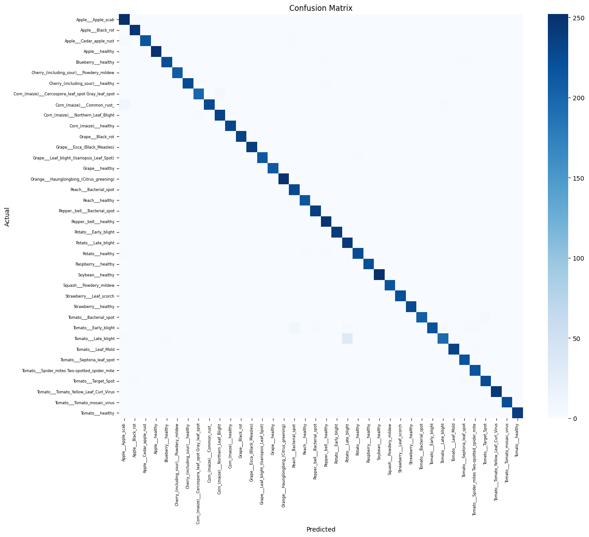

# 🌿 AgriVision — Plant Disease Detection

## Problem Statement

Inexperienced farmers often face difficulty identifying plant diseases. In rural areas, access to agricultural experts is limited, which leads to financial losses.

## My Solution

To solve this problem, I developed **AgriVision** which is a deep learning based web application that detects plant diseases from leaf images.

This system allows users to:
- Upload an image of a plant leaf
- Get instant disease prediction
- Gives the cause and cure of the detected disease

🔗 **Live Demo:** [agrivision-plant-disease-detection.onrender.com](https://agrivision-plant-disease-detection.onrender.com/)
> ⚠️ Note: First load may be slow due to Render free tier cold start.

## ✨ Features

- Multi-class plant disease classification (38 classes) 
- Image upload functionality
- FastAPI backend for efficient inference
- Simple frontend using HTML, CSS, and JavaScript
- Dockerized for easy deployment
- Deployable on cloud platforms (AWS / Render)

## Project Structure

```
AgriVision-Plant-Disease-Detection/
│
├── model_development/      # Training and testing code
├── src/                    # Backend API
├── frontend/               # Web UI (HTML/CSS/JS)
├── dockerfile              # Docker configuration
├── requirements.txt        # Python dependencies
└── README.md
```

## Model

- **Architecture:** EfficientNetB3 (CNN based)
- **Dataset:** [PlantVillage — 38 disease classes across 14 crop species](https://www.kaggle.com/datasets/nikhilbhagat77/plant-ds/data)
- **Task:** Multi-class image classification
- **Framework:** PyTorch

## Model Performance

Accuracy: 98%
> Evaluated on the PlantVillage test set (38 disease classes)



## Tech Stack

| Layer       | Technology              |
|-------------|-------------------------|
| Model       | Python, PyTorch         |
| Backend     | FastAPI                 |
| Frontend    | HTML, CSS, JavaScript   |
| Deployment  | Docker                  |

## ⚙️ Installation & Setup

```bash
# clone repo
git clone https://github.com/nikhilbhagat7/AgriVision-Plant-Disease-Detection.git
cd AgriVision-Plant-Disease-Detection
# create virtual environment
python -m venv venv
source venv/bin/activate   # Linux/Mac
venv\Scripts\activate      # Windows
# install required libraries
pip install -r requirements.txt
uvicorn src.api.main:app --reload
```
Then open your browser at **http://localhost:8000**


## 🐳 Docker
```bash
docker pull nikhilbhagat7/agrivision-plant-disease-detection:latest
docker run -p 10000:10000 nikhilbhagat7/agrivision-plant-disease-detection:latest
```
Then open your browser at **http://localhost:10000**

## 📄 License

This project is licensed under the [MIT License](LICENSE).

## 👤 Author

**Nikhil Bhagat**
[GitHub](https://github.com/nikhilbhagat7)